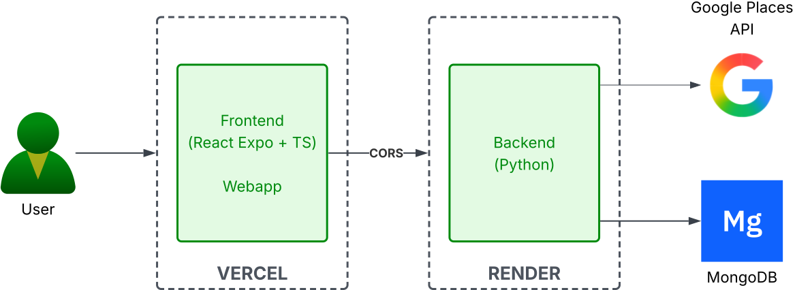

# ResRank-App

Restaurant Ranking App deployed in `vercel` and `render`.
Backend is connected to Google Places API to fetch restaurants and places for the app. \
It uses `MongoDB` as NoSQL database storing all relevant information.

